 

 
# HomeShots - A web app for home aesthetics enthusiasts to share images of beautiful homes
 

<h1 id="contents">Contents</h1>

 * [Introduction](#introduction)
 * [Live Site](#live-site)
 * [Backend API repository](#backend-api-repository)
 * [User Experience](#user-experience)
   + [Strategy](#strategy)
     - [Project Goal](#project-goal)
     - [Project Objectives](#project-objectives)
     - [Target Audience](#target-audience)
     - [Establish Branding and Positioning](#establish-branding-and-positioning)
     - [Content Strategy](#content-strategy)
     - [Technology and Platform Selection](#technology-and-platform-selection)
   + [Scope](#scope)
     - [User Story](#user-story)
     - [Simple and intuitive User Experience](#simple-and-intuitive-user-experience)
     - [Relevant content](#relevant-content)
     - [User Story](#user-story)
   + [Structure](#structure)
   + [Skeleton](#skeleton)
   + [Surface](#surface)
     - [Color Scheme](#color-scheme)
     - [Fonts](#fonts)
     - [Visual Effects](#visual-effects)
 * [Agile Methodology](#agile-methodology)
   + [User Story](#user-story)
   + [Sprint ](#sprint)
 * [Features](#features)
   + [Home Page](#home-page)
   + [Navigation Desktop](#navigation-desktop)
   + [Navigation Mobile](#navigation-mobile)
   + [homeShot Details](#homeshot-details)
   + [homeShots Sidebar](#homeshots-sidebar)
   + [homeShots Feed](#homeshots-feed)
   + [Liked homeShots](#liked-homeshots)
   + [Search Results](#search-results)
   + [homeShot Profile](#profile)
   + [Future Features](#future-features)
 * [Technologies](#technologies)
   + [Languages](#languages)
   + [React Packages](#react-packages)
   + [Frameworks Libraries Programs](#frameworks-libraries-programs)
 * [Development](#development)
   + [Custom Components](#custom-components)
   + [Custom Hooks](#custom-hooks)
   + [Contexts](#custom-contexts)
   + [React Component Diagram](#component-diagram)
 * [Testing](TESTING.md)
   + [Automated Jest Testing Results](#testing-results)
   + [Manual Testing Results](#testing-results)
   + [Bugs](TESTING.md#bugs)
 * [Deployment](#deployment)
 * [Credits](#credits)

## Introduction
HomeShots is a frontend React.js project that runs on Heroku. It aims to provide a platform for Home aesthetics enthusiasts to snap and share beautiful homes 

This app allows users to upload photo shots of homes they find interesting. Users can create, edit, add comments and add location details from the frontend once registered & logged in. 
**HomeShots- photo sharing website** was developed using Python (Django), HTML, CSS and JavaScript and storing the data in a PostgreSQL database.
  

## Live Site
A live version of the site can be found <a href="https://home-shots-c660d38e541d.herokuapp.com/" target="_blank">HERE</a>

## Backend API repository
The backend API repository can be found <a href="https://github.com/chikadim/home-shots-backend" target="_blank">HERE</a>
  

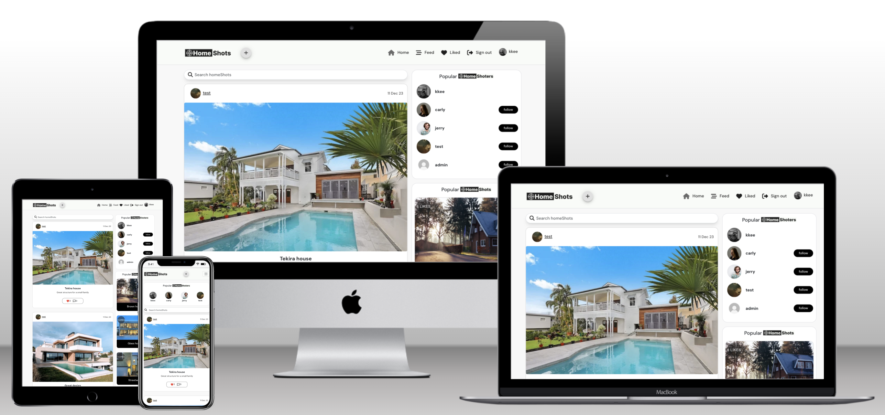  

## User Experience
This site was created respecting the Five Planes Of Website Design: 
 

### _Strategy_

#### Project Goal
* Create a website for home aesthetics enthusiasts.  

#### Project Objectives
* To create a website with a simple and intuitive User Experience.
* To add content that is relevant and helps create a better image of the owner of the website.
* To differentiate between users and staff member accounts.
* To implement fully functional features that will ease the staff members' tasks and upgrade users' experience with the website services.
* To make the website available and functional on every device.  

#### Target Audience
* Architect
* Engineers
* Developers
* Interior decorators
* Landscape designers and builders  

#### Establish Branding and Positioning
* To create a distinct brand identity that resonates with the target audience.
* To develop a brand strategy, including visual elements such as color schemes, typography, and imagery.
* Brand guidelines that reflect the aesthetic preferences of the target audience and establish a unique brand identity.  

#### Content Strategy
* Determine the type of content that will engage and resonate with home aesthetics enthusiasts.
* Plan content categories, formats, and distribution channels. Consider incorporating visual elements, such as high-quality images.
* Content strategy outlining the themes, topics, and formats that will appeal to the target audience.  

#### Technology and Platform Selection
* Determine the type of content that will engage and resonate with home aesthetics enthusiasts.
* Plan content categories, formats, and distribution channels. Consider incorporating visual elements, such as high-quality images.
* Content strategy outlining the themes, topics, and formats that will appeal to the target audience.  

### _Scope_

#### User Stories
* As part of the software development process, i will be referring to this User Stories throughout the project.

  |   EPIC                                |ID|                                User Story                                                   |
  | :-------------------------------------|--|:------------------------------------------------------------------------------------------- |
  |**NAVIGATION**                         |  ||
  |                                       |1A| As a user, I can see a navbar or menu so that I can easily navigate through website content |
  |                                       |1B| As a user, I can navigate through website pages quickly so that I can view content seamlessly without page refresh. |    
  |                                       |1C| As a user, I can see relevant information about the website so that I can go to the page of my interest. |
  |**USER REGISTRATION/AUTENTHICATION**   |  || 
  |                                       |2A| As a user, I can sign up for an account on the website so that I can access all the site features. |
  |                                       |2B| As a user, I can sign in so that I can interact with the content on the site. |
  |                                       |2C| As a user, I can authenticate using only email and password so that I can access all the features provided for authenticated users. |
  |                                       |2D| As a signed-in user, I can maintain my signed-in status until I choose to log out so that I ensure my user experience is not compromised. |
  |                                       |2E| As a signed-in user, I can be able to sign out so that I can exit my account and keep it safe. |
  |                                       |2F| As a signed-in user, I can tell if i am signed in or not so that I can sign in if I need to. |
  |**ALL POSTS**                          |  || 
  |                                       |3A| As a user, I can expect the website to have a nice and intuitive design so that I can have a great user experience. |
  |                                       |3B| As a user, I can view all the most recent HomeShots posts, ordered by most recently created first so that I can be up to date with the newest content.|
  |                                       |3C| As a user, I can search for HomeShots posts with keywords so that I can find the posts and user profiles I am most interested in.
  |                                       |3D| As a user, I can click on HomeShots post so that I can view the HomeShots and its details. |
  |                                       |3E| As a user, I can view the number of likes on HomeShots posts so that I can easily see posts that have more likes.|
  |                                       |3F| As a user, I can view the number of comments on HomeShots posts so that I can read other users' opinions about a post.|
  |                                       |3G| As a user, I can keep scrolling through HomeShots posts on the site, that are loaded for me automatically so that I can not click on "next page" etc.|
  |**POST**                               |  || 
  |                                       |4A| As a signed-in user, I can create a new HomeShots posts and upload an image so that I can share my shots with other users.|
  |                                       |4B| As a signed-in user, I can edit a HomeShots post, change the image or update the details so that I can improve my posts.|
  |                                       |4C| As a signed-in user, I can delete my HomeShots post so that I can control what posts are displayed in my name. |
  |                                       |4D| As a signed-in user, I can like/unlike HomeShots posts so that I can view my liked HomeShots on a single liked HomeShots page.|
  |                                       |4E| As a signed-in user, I can follow/unfollow other HomeShots so that I can view my followed HomeShots posts on a single feed page.|
  |                                       |4F| As a signed-in user, I can comment on a post so that i can give my opinion on a post and read other users' opinions.|
  |                                       |4G| As a signed-in user, I can delete or edit my previous comments so that I can have only the comments I want to be displayed.|
  |**PROFILE**                            |  || 
  |                                       |5A| As a user, I can view other users profiles so that I can see their posts and learn more about them.|
  |                                       |5B| As a user, I can view statistics about a specific user: bio, number of posts, follows and users followed so that I can learn more about them. |
  |                                       |5C| As a user, I can see a list of the most followed profiles so that I can see which profiles are popular. |
  |                                       |5D| As a signed-in user, I can follow/unfollow other HomeShots so that I can view my followed HomeShots posts on a single feed page.|
  |                                       |5E| As a signed-in user, I can view all the posts by a specific user so that I can catch up on their latest posts, or decide I want to follow them. |
  |                                       |5F| As a signed-in user, I can edit my profile so that I can change my profile picture and bio.|
  |                                       |5G| As a signed-in user, I can update my username and password so that I can change my display name and keep my profile secure.|
  |                                       |  || 

#### Simple and intuitive User Experience
* Ensure the navigation menu is visible and functional at every step.
* Ensure every page has a suggestive name that fits its content.
* Ensure the users will get visual feedback when navigating through pages.
* Create a design that matches the project theme and does not confuse the users.

#### Relevant content
* Add information about project name, location and contact data.
* Make a clear and beautiful designed presentation of the menu elements.
* Create a section with the most visited post.
* Create a section with accounts that is most visited.

**Responsiveness:**
* Create a responsive design for desktop, tablet and mobile devices
  

### _Structure_

The structure of the website is divided into pages but with content depending on authentication and user/staff status  
-**Register/Login** pages give the user the possibility to create an account and authenticate for accessing different features. 
-**Logout** feature is a modal that helps user exit their current account; 

### _Skeleton_

### _Surface_
**Color Scheme** I decided to stick with the high contrast colour palette to maintain a nice visual contrast when viewing the site.
-   Background: #ffffff
-   Headings: #000000
-   Navbar: #f8f8f8

**Typography** I used the DM Sans font for the complete site to keep it clean and modern.

**Media** I decided to stick with the high contrast colour palette to maintain a nice visual contrast when viewing the site.
-   All images are taken from<a href="https://unsplash.com/" target="_blank"> Unsplash </a>
-   The logo and favicon are designed by me in<a href="https://www.figma.com" target="_blank"> Figma </a>

**Wireframes** Initial Wireframes
The wireframes were created using <a href="https://figma.com/">Figma</a>

-   Desktop

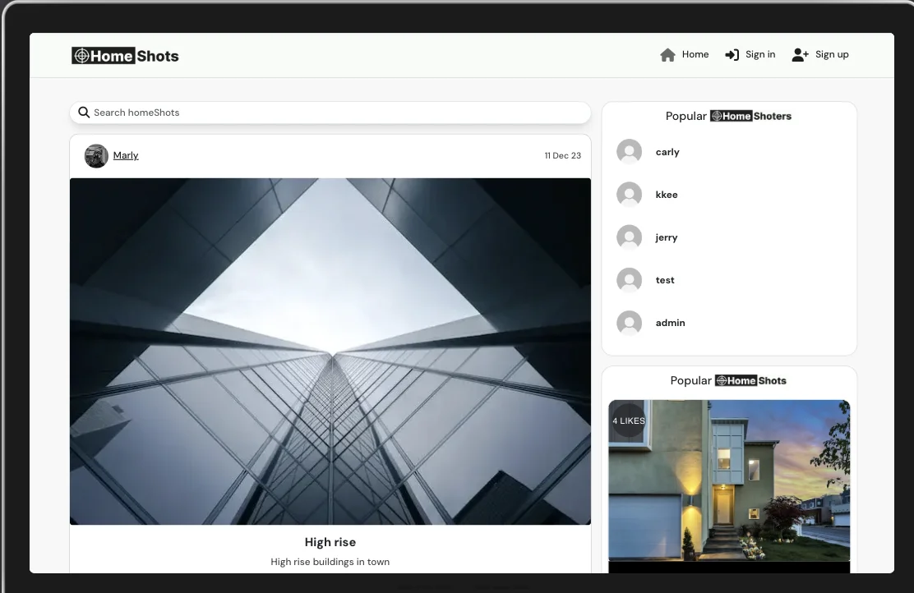

-   Mobile

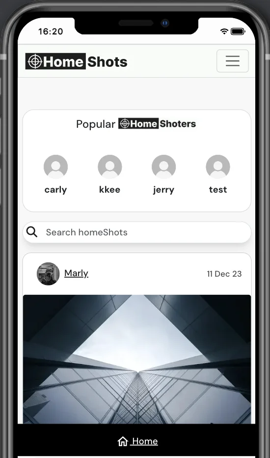
 

## Agile Methodology

The Agile Methodology was used to plan this project. This was implemented through Github and the Project Board which can be seen here - <a href="https://github.com/users/chikadim/projects/16" target="_blank"> homeShots React User Stories</a>

Through the use of the Kanban board in the projects view in Github, the project was divived into a few different sections:

-   Addons
-   Todo
-   In Progress
-   Done

### User Story
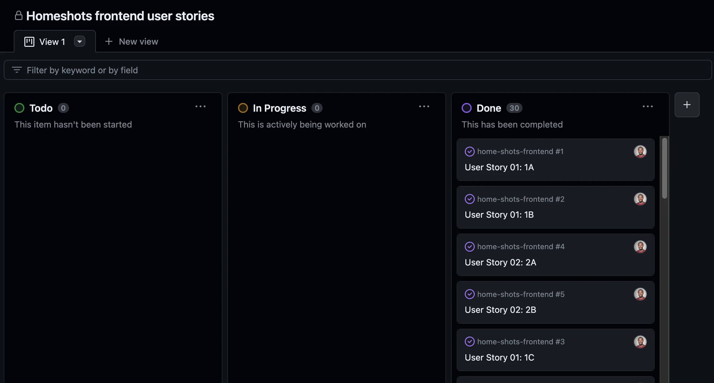

Github issues were used to create User Stories and any other fixes or updates for the project. This was where the project user was assigned, labels were added to provide clarity, and the story was added to the appropriate sprint and the project. Each User Story, Fix or Update had a clear title.

Milestones were used to create sprints. User Stories were completed based on the current sprint in progress. Each sprint was completed on time.

The Github issues were not just used to record User Stories but also used to record any bug fixes or updates to the codebase as well.

## Features

### Home Page
- The Home Page is the landing page of the website and that's visible first when the site loads. It is designed to allow the user to quickly find their way around the site. The homepage displays all homeShots in chronological order by lateset first and the sidebar displays the top followed homeShoters and below that the top liked homeShots.

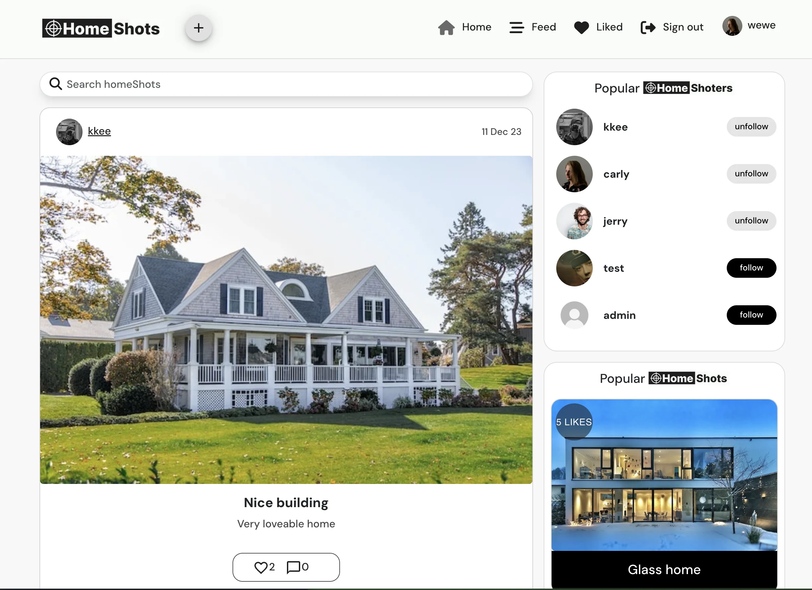

### Navigation Desktop
-   The site navigation is done through the navigation bar at the top of each page & this is consistant throughout the website.

-   The navigation bar at the top of each page is sticky to allow access to the navigation at any time.

-   Options on the navigation bar change depending on whether the user is logged in or not.

-   Navigation menu when nobody is logged in only options are home, login & sign-up.

-   Navigation menu when an authenticated user is logged in options are home, feed, liked, sign out & profile.

-   Users also have the + icon to add a new homeShot.

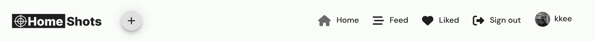

### Navigation Mobile

<a href="#top">Back to the top.</a>

-   Navigation menu when nobody is logged in only menu options are home, login & sign-up.

-   There is also a sticky footer navigation on mobile with only the home option.

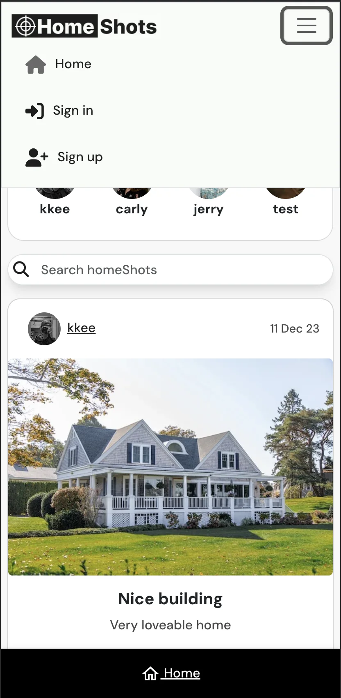

-   Navigation menu when regular authenticated user is logged in options are home, feed, liked, sign out & profile.

-   There is also a sticky footer navigation on mobile with the home, feed & liked options.

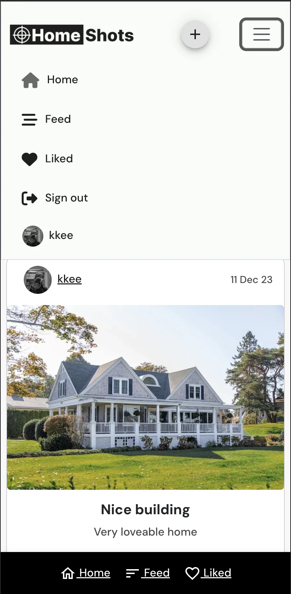

### homeShot Details

<a href="#top">Back to the top.</a>

-   When an authenticated user is logged in they can upload, create, edit, like, comment & add a location on the homeShot detail page.

-   A tooltip displays extra info to the user regarding the button functionaliity.

-   Create homeShot

-   Edit homeShot by clicking on the 3 dots icon on the details page.

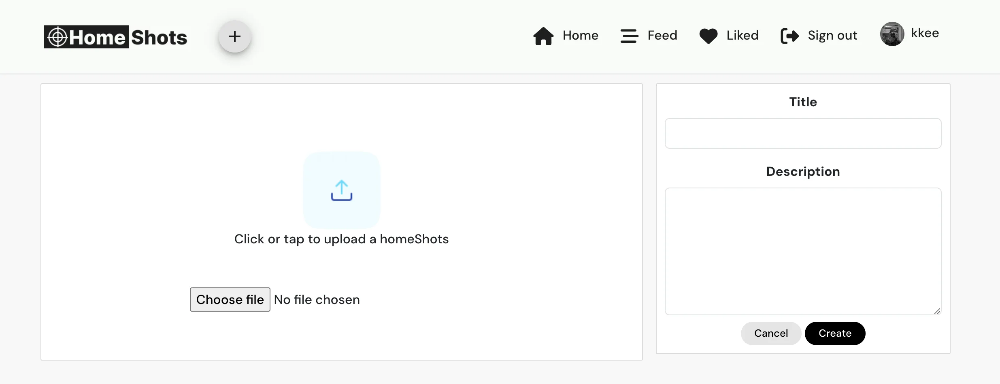

-   Add homeShot location.

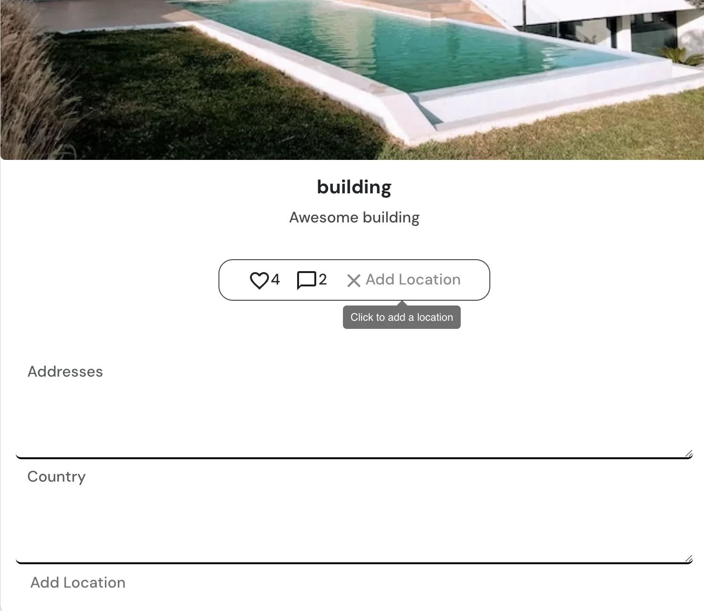

-   Close Location once openend the icon changes to an X.

-   Add a comment

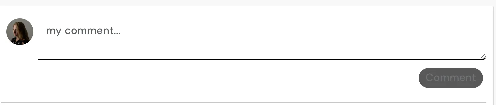

-   Edit a comment by clicking on the 3 dots icon.

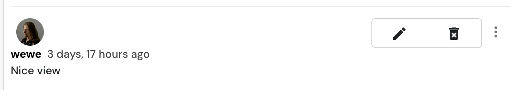

### homeShots Sidebar

<a href="#top">Back to the top.</a>

-   The sidebar displays the top 6 followed homeShoters with 1 or more followers and below that the 4 top liked homeShots with 2 or more likes.

-   You can also follow or unfollow a homeShoter here.

-   Popular homeShoters

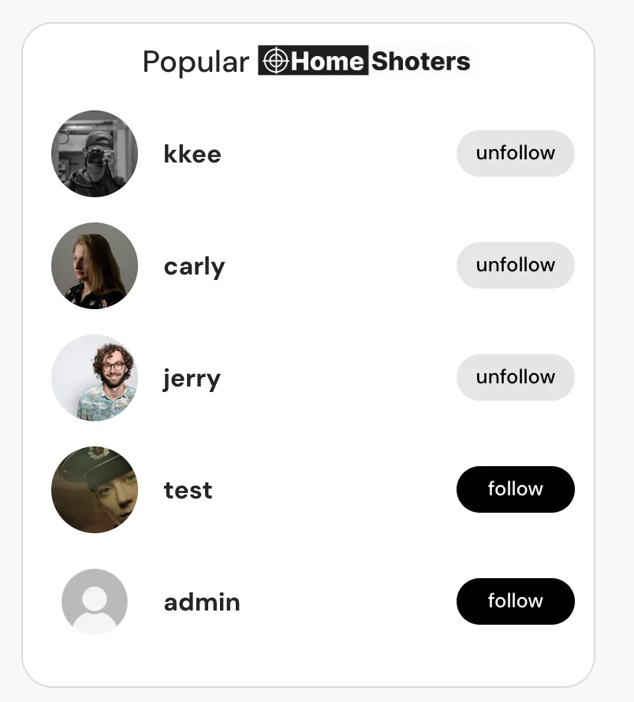

-   Below the top 6 followed homeShoters the sidebar displays the 4 top liked homeShots with 2 or more likes in decending order.

-   Popular homeShots

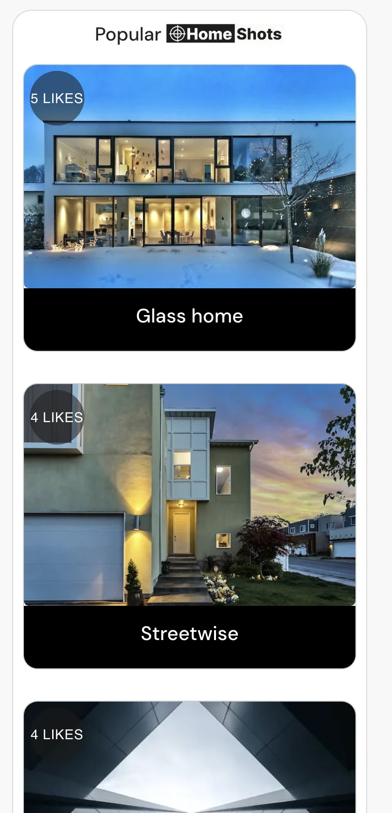

### homeShots Feed

<a href="#top">Back to the top.</a>

-   When an authenticated user follows a homeShoter this will be added to their feed page which can be accessed by clicking on the feed icon on the navbar.

-   A title is shown "homeShoters You Follow" under the search bar to display to the user that you are on the feed page.

-   If the user has not followed anyone a message will appear to follow a user.

### Liked homeShots

<a href="#top">Back to the top.</a>

-   When an authenticated user likes a homeShot this will be added to their liked homeShots page which can be accessed by clicking on the heart liked icon on the navbar.

-   A title is shown "homeShots You Liked" under the search bar to display to the user that you are on the liked page.

-   If the user has not liked any homeShots a message will appear to like a homeShot first.

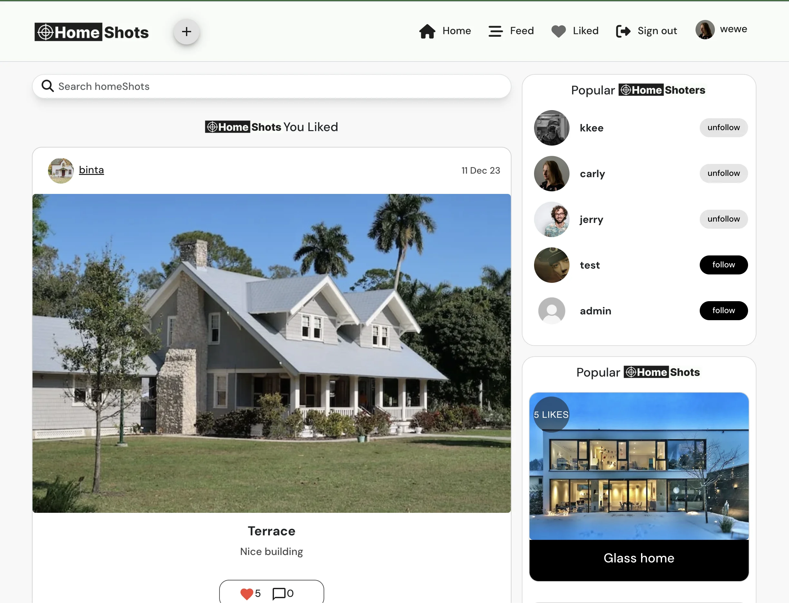

### Search Results

<a href="#top">Back to the top.</a>

-   Enter a search word in the search box and click enter the search results will be displayed filterd by the search word.

-   The search is performed on the homeShots title & the username fields.

-   Once you start typing a X appears on the right hand side and if clicked this clears the search bar.

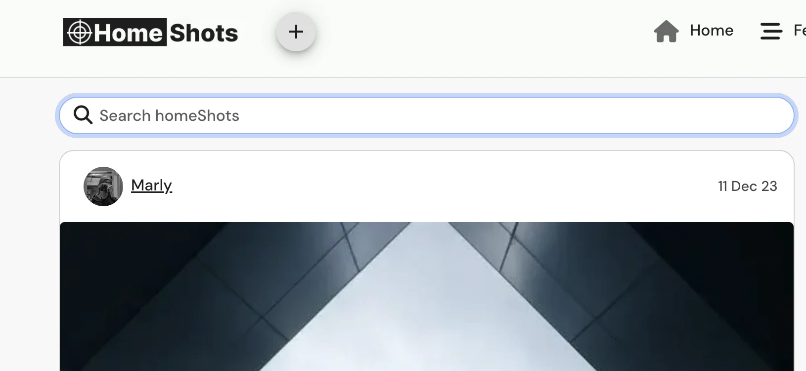

### Profile
-   On the profile page the user can view all the homeShots they have created.

-   This can be accessed by clicking on the profile image on the top right of the navbar.

-   The user can also see how many homeShots they have liked and how many homeShoters they folllow.

-   If the user is the owner of the profile they can edit their profile by clicking on the 3 dots.

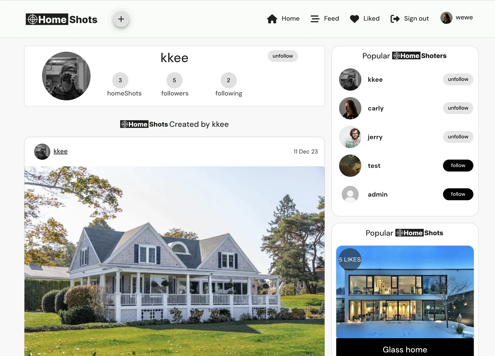

-   You can change the image and your bio here.

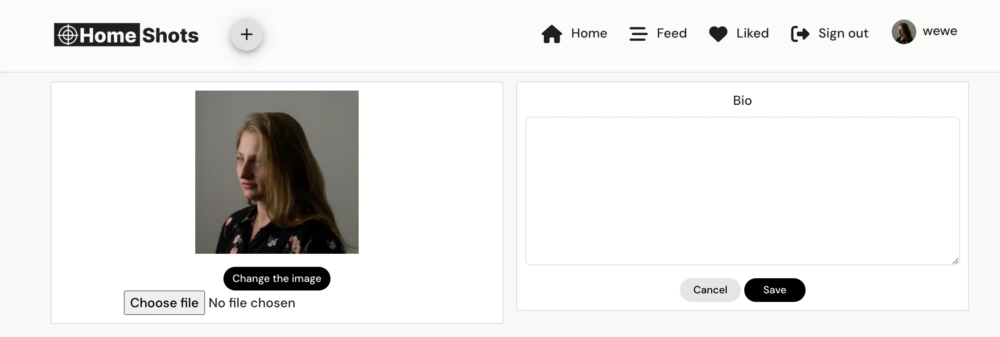

<a href="#top">Back to the top.</a>

### Future Features

<a href="#top">Back to the top.</a>

-   Social login to allow the user to signup using Facebook or Google.

-   Allow users to tag each other by username.

-   Allowing users to share their homeShots with other homeShots users.

## Technologies

<a href="#top">Back to the top.</a>

Throughout the planning, design, testing and deployment of the homeShots app, I have used a number of technologies listed below:

### Languages

-   [HTML 5](https://en.wikipedia.org/wiki/HTML/)
-   [CSS 3](https://en.wikipedia.org/wiki/CSS)
-   [JavaScript](https://www.javascript.com/)
-   [React](https://reactjs.org/)

### React Packages

-   [NPM](https://www.npmjs.com/package/node) 
    Package manager used to install dependencies
-   [React Bootstrap](https://react-bootstrap.github.io/) 
    Was used to style the website, add responsiveness and interactivity
-   [Axios](https://axios-http.com/docs/intro) 
    As the HTTP client for the app.
-   [Material UI](https://mui.com/) 
    Was used for certain components and icons.
-   [JWT Decode](https://www.npmjs.com/package/jwt-decode) 
    To help decoding JWTs token which are Base64Url encoded.
-   [Notistack](https://notistack.com/) 
    It allows notifications to be stacked on top of one another.
-   [react-infinite-scroll-component](https://www.npmjs.com/package/react-infinite-scroll-component) 
    A component to make the post load as an infinite scroll.
-   [Zustand](https://docs.pmnd.rs/zustand/getting-started/introduction) 
    A small, fast and scalable bearbones state-management solution.
-   [react-router-dom](https://www.npmjs.com/package/react-router-dom) 
    Bindings for using React Router in web applications.
-   [jest-dom](https://testing-library.com/docs/ecosystem-jest-dom/) 
    Testing Library that provides custom DOM element matchers for Jest.
-   [ESLint](https://eslint.org/) 
    ESLint was used to evaluate all the React.js code

### Frameworks Libraries Programs

-   [ElephantSQL](https://www.elephantsql.com/) 
    ElephantSQL is a PostgreSQL database hosting service were the database for homeShots was created
-   [Git](https://git-scm.com/) 
    Git was used for version control by utilizing the Gitpod terminal to commit to Git and push to GitHub
-   [GitHub](https://github.com/) 
    GitHub is used to store the project's code after being pushed from Git
-   [Heroku](https://id.heroku.com) 
    Heroku was used to deploy the live project
-   [VSCode](https://code.visualstudio.com/) 
    VSCode was used to create and edit the app
-   [Whimsical](https://whimsical.com/) 
    Whimsical was used to create the wireframes & flow chart
-   [W3C - HTML](https://validator.w3.org/) 
    W3C- HTML was used to validate all the HTML code
-   [W3C - CSS](https://jigsaw.w3.org/css-validator/) 
    W3C - CSS was used to validate the CSS code
-   [Fontawesome](https://fontawesome.com/) 
    To add icons to the app
-   [Google Chrome Dev Tools](https://developer.chrome.com/docs/devtools/) 
    To check App responsiveness and debugging
-   [Adobe Photoshop](https://www.adobe.com/ie/products/photoshop.html) 
    To convert the images to webp format
-   [Figma](https://www.Figma.com/) 
    To build the logo and icon for the project
-   [Tables Generator](https://tablesgenerator.com/) 
    To build the tables in the readme.md file

## Development

<a href="#top">Back to the top.</a>

### Custom Components

<a href="#top">Back to the top.</a>

Custom components were created to enable the code and functionality to be re-used throughout the homeShots app

-   [PopularPosts.js](https://github.com/chikadim/home-shots-frontend/blob/main/src/components/posts/PopularPosts.js) was created to display the 4 most liked posts in decending order by amount of likes and equal or more than 2 likes.

-   [PopularProfiles.js](https://github.com/chikadim/home-shots-frontend/blob/main/src/components/profiles/PopularProfiles.js) was created to display the 6 most followed homeShoters in decending order by amount of followers and equal or more than 1 follower.

-   [ConfirmDialog.js](https://github.com/chikadim/home-shots-frontend/blob/main/src/components/ConfirmDialog.js) was created to enable a popup modal to confirm the users action before content deletions.

-   [ScrollToTop.js](https://github.com/chikadim/home-shots-frontend/blob/main/src/components/ScrollToTop.js) was created to scroll the user to the top of the page on navigation to a new page.

-   [AlertPopUp.js](https://github.com/chikadim/home-shots-frontend/blob/main/src/components/AlertPopup.js) was created to enable toast messaging on user success and error actions.

-   [FloatingActionButton.js ](https://github.com/chikadim/home-shots-frontend/blob/main/src/components/FloatingActionButton.js) was created to enable the + icon in the NavBar to allow a user to add a new homeShot and display a tooltip on desktop hover.

-   [FooterNavBar.js](https://github.com/chikadim/home-shots-frontend/blob/main/src/components/FooterNavBar.js) was created to display a sticky footer on mobile with different icons depending on if the user is logged in or not.

-   [NavBar.js](https://github.com/chikadim/home-shots-frontend/blob/main/src/components/NavBar.js) was created to display the navigation menu and display different icons depending on if the user is logged in or not.

-   [Asset.js](https://github.com/chikadim/home-shots-frontend/blob/main/src/components/Asset.js) was created to display a spinner when data is being fetched to notify the user that an action is being performed.

-   [Avatar.js](https://github.com/chikadim/home-shots-frontend/blob/main/src/components/Avatar.js) was created to display the users profile image throughout the app.

-   [NotFound.js](https://github.com/chikadim/home-shots-frontend/blob/main/src/components/NotFound.js) was created to display a message to the user if the content they are looking for does not exist.

-   [MoreDropdown.js](https://github.com/chikadim/home-shots-frontend/blob/main/src/components/MoreDropdown.js) was created to display a message to the user if the content they are looking for does not exist.

-   [FollowedHomeShoters.js](https://github.com/chikadim/home-shots-frontend/blob/main/src/components/FollowedHomeShoters.js) was created to display a message "homeShoters You Follow" at the top of the feed page based on on the URL being /feed.

-   [HomeShotMessage.js](https://github.com/chikadim/home-shots-frontend/blob/main/src/components/HomeShotMessage.js) was created to display a message with message props to change the data at the top of the profile and liked page.

### Custom Hooks

-   [useAlert.js](https://github.com/chikadim/home-shots-frontend/blob/main/src/hooks/useAlert.js) hook was created to call the alert messaging in the app

-   [useRedirect.js](https://github.com/chikadim/home-shots-frontend/blob/main/src/hooks/useRedirect.js) was created to redirect the user to the homepage based on their userAuthStatus

-   [useClickOutsideToggle.js](https://github.com/chikadim/home-shots-frontend/blob/main/src/hooks/useClickOutsideToggle.js) was created close the expanded menu on a click outside the menu at every stage in the app

### Context

-   [AlertContext.js](https://github.com/chikadim/home-shots-frontend/blob/main/src/contexts/AlertContext.js) was created to allow the alert functionality to be used at every stage in the app

-   [CurrentUserContext.js](https://github.com/chikadim/home-shots-frontend/blob/main/src/contexts/CurrentUserContext.js) was created to get the current users authentication state and redirect the user to the signin page if not signed in.

-   [ProfileDataContext.js](https://github.com/chikadim/home-shots-frontend/blob/main/src/contexts/ProfileDataContext.js) was created to setProfileData, handleFollow, handleUnfollow of user profiles and access this data throughout the app.

## Testing

<a href="#top">Back to the top.</a>

### Automated Testing Results

-   Automated Jest Testing results [HERE](TESTING.md#automated-testing)

### Manual Testing Results

-   Manual Testing results [HERE](TESTING.md#manual-testing)

## Deployment

<a href="#top">Back to the top.</a>

### This project was created on GitHub and edited in GitPod by carrying out the following:

<ol>
    <li>A new repository was created without a template</li>
    <li>A meaningful name was given to my new repository and I selected 'Create Repository'</li>
    <li>I then opened the repository on GitHub and clicked the 'Gitpod' button to build the GitPod workspace which would allow me to build and edit the code used to make the <em>homeShot</em> app.</li>
    <li>Version control was used throughout the project using the following commands in the terminal using Bash
        <ul>
            <li>git add . <strong>OR</strong> git add "file name" - to stage the changes and get them ready for being committed to the local repo.</li> 
            <li>git commit -m "Description of the update" - to save the change and commit the change to the local repo</li>
            <li>git push - to push all committed changes to the GitHub</li>
            <li>commit --amend - for changing the wording or spelling of the most recent commit</li>
            <li>git reset "commit hash" </li>
            <li>git push -f - This was used to force changes through to the GitHub repo if either "commit --amend" or "git reset" were used</li>
        </ul>
    </li>

## Heroku

The project was deployed via <a href="https://id.heroku.com/login" target="_blank">Heroku</a>, and the live link can be found here: <a href="https://home-shots-c660d38e541d.herokuapp.com/" target="_blank">homeShot</a>

Some of the deployment steps below are specifically required for this project and may not be applicable to older versions, or different projects.

Before deploying to Heroku I created the Procfile with web: serve -s build

Created .slugignore with /documentation, README.md & TESTING.md as paths to ignore in Heroku as I don't want the documentation to upload to Heroku.

This project was deployed to Heroku 

## Deployment Steps On Heroku.

-   In Heroku create a new app, give it a name and choose location.

-   In the deploy tab, go to 'deployment method', choose 'Github'

-   Search for the repository in Github that you want to connect and click on the connect button

-   In the 'manual deploy' section click on 'deploy branch'

-   The build log will run, when complete you will see a message saying 'build succeeded'

-   An 'Open App' button will appear, click this to take you to your deployed app.

-   You can enable automatic deploys in the 'deployment section' so each time you push your code to 'Github' your deployed app will be updated.

## Github Local Deployment

There are many ways to deploy the project locally on your own device. Forking, Cloning, GitHub Desktop and Zip Exctraction, the steps in these processes are outlined below:

### Forking the GitHub repo

If you want to make changes to the repo without affecting it, you can make a copy of it by 'Forking' it. This will make sure that the original repo remains unchanged.

<ol>
    <li>Log in to your GitHub account</li>
    <li>Navigate to the repository <a href="https://github.com/chikadim/home-shots-frontend/" target="_blank"><strong>HERE</strong></a></li>
    <li>Select the 'Fork' button in the top right corner of the page (under your account image)</li>
    <li>The repo has now been copied into your own repos and you can work on it in your chosen IDE</li>
    <li>If you have any suggestions to make regards to the code to make the site better, you can put in a pull request</li>
</ol>

### Cloning the repo with GitPod

<ol>
    <li>Log in to your GitHub account</li>
    <li>Navigate to the Repository <a href="https://github.com/chikadim/home-shots-frontend/" target="_blank"><strong>HERE</strong></a></li>
    <li>Select the 'Code' button above the file list on the right had side</li>
    <li>Ensure HTTPS is selected and click the clipboard on the right of the URL to copy it</li>
    <li>Open a new workspace in GitPod</li>
    <li>In the bash terminal type 'git clone [copy url here from step 4]'</li>
    <li>Press enter - the IDE will clone and download the repo</li>
</ol>

### Github Desktop

<ol>
    <li>Log in to your GitHub account</li>
    <li>Navigate to the Repository <a href="https://github.com/chikadim/home-shots-frontend/" target="_blank"><strong>HERE</strong></a></li>
    <li>Select the 'Code' button above the file list on the right had side</li>
    <li>Select 'Open with GitHub Desktop'</li>
    <li>If you haven't already installed GitHub desktop application - you will need to follow the relevant steps to do this</li>
    <li>The repo will then be copied locally onto your machine</li>
</ol>

### Download and extract the zip directly from GitHub

<ol>
    <li>Log in to your GitHub account</li>
    <li>Navigate to the Repository <a href="https://github.com/chikadim/home-shots-frontend/" target="_blank"><strong>HERE</strong></a></li>
    <li>Select the 'Code' button above the file list on the right had side</li>
    <li>Select 'Download Zip'</li>
    <li>Once you have the Zip downloaded, open it with your prefered file decompression software</li>
    <li>You can then drag and drop the files from the folder into your chosen IDE or view/edit them on your local machine</li>
    <li>If you want to create a web-app from the repo please follow the instructions in "Project Deployment"</li>
</ol>

<h1 id="credits">Credits</h1>

<a href="#top">Back to the top.</a>

### I have listed some of the resources I used for inspiration and in researching how to create the homeShots app.

-   Code Institute "Moments" tutorial helped me setup the initial code for homeShot.

-   All the header images are from <a href="https://unsplash.com/" target="_blank"><strong>Unsplash</strong></a>

### These are some of the resources that helped me solve some of the issues encountered when developing the site and also provided some inspiration

-   [W3Schools - React](https://www.w3schools.com/react/default.asp)
-   [Stack Overflow](https://stackoverflow.com/) for various code snippets and solutions
-   [React Documentation](https://reactjs.org/)
-   [React Testing Jest](https://jestjs.io/docs/tutorial-react)
-   [React Testing Jest Cheatsheet](https://devhints.io/jest)
-   [React Social Media Site](https://www.youtube.com/watch?v=zM93yZ_8SvE)
-   [React Social Media App Design](https://www.youtube.com/watch?v=FweHcYHkt9A)
-   [Material UI](https://mui.com/)
-   [Material UI Reusable Confirmation Dialog](https://dev.to/uguremirmustafa/material-ui-reusable-confirmation-dialog-in-react-2jnl)
-   [React Scroll Restoration](https://v5.reactrouter.com/web/guides/scroll-restoration)
-   [Scroll to top on route change](https://www.kindacode.com/article/react-router-dom-scroll-to-top-on-route-change/)

<h2 id="acknowledgements">Acknowledgements</h2>

<a href="#top">Back to the top.</a>

This project was made possible due to the help & advice from my Code Institute mentor ADEGBENGA ADEYE, Code Institute Slack community, Stack Overflow community, my wife and family and a lot of extensive Googling.
