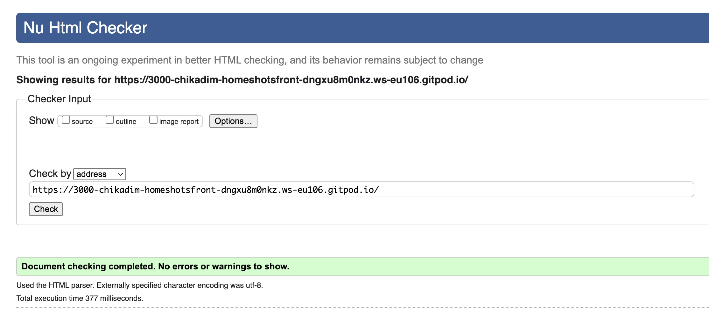

<h1 id="contents">homeShot Frontend Testing</h1>

Back to the [README](README.md)

<h1 id="contents">Contents</h1>

-   [Introduction](#introduction)
-   [Messaging / Alerts](#messaging)
-   [ESlint Validator](#eslint-validation)
-   [HTML Validator](#html-validation)
-   [CSS Validator](#css-validation)
-   [Console Results](#console-results)
-   [Lighthouse Results](#lighthouse)
    -   [Desktop](#lighthouse-desktop)
    -   [Mobile](#lighthouse-mobile)
-   [Bugs / Issues](#bugs)

<h1 id="introduction">Introduction</h1>

Project Milestone 5 for Code Institute Full-stack development program. homeShots - all testing results and code validation are listed below.<br>
Testing has taken place continuously throughout the development of the project. The app was tested regularly and deployed early to Heroku to confirm local and remote functioned the same.

<h1 id="eslint-validation">ESLint Validation</h1>

<a href="#top">Back to the top</a>

All validation fixes recommended by ESLint were fixed and the follwing rules added to the .eslintrc.json configuration file.
The code now validates with ESLint

```
 "rules": {
    "react/react-in-jsx-scope": "off",
    "react/prop-types": "off",
    "no-unused-vars": ["warn", { "argsIgnorePattern": "req|res|next|__" }],
    "allowEmptyCatch": 0,
    "no-undef": "off",
    "react/display-name": "off"
    }
```

<h1 id="html-validation">HTML Validation</h1>

